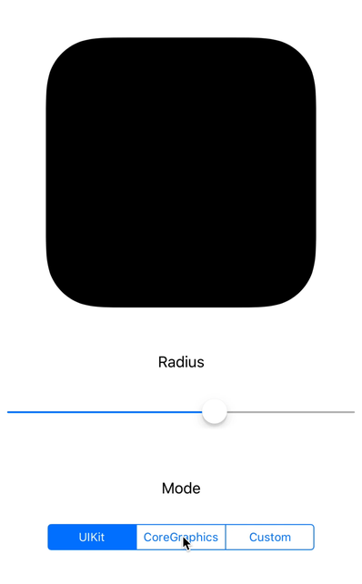

# SGMSuperEllipsePath

A `UIBezierPath` category for creating **Apple Flavored Smooth Corners**, the corner's curvature is more continuous than normal.

This project is based on the project [everdrone/react-native-super-ellipse-mask](https://github.com/everdrone/react-native-super-ellipse-mask).

In fact `+[UIBezierPath bezierPathWithRoundedRect:cornerRadius:]` already provides **Smooth Corners**, this project is just for research and testing. 

You can see the corner curvature difference between **UIKit**, **CoreGraphics** and **SGMSuperEllipsePath** in the demo app.

If you are interested in **Curvature Continuity**, you can check [s4y/continuousCorners](https://github.com/s4y/continuousCorners) and this [notebook](https://beta.observablehq.com/@dhotson/drawing-better-looking-curves).
